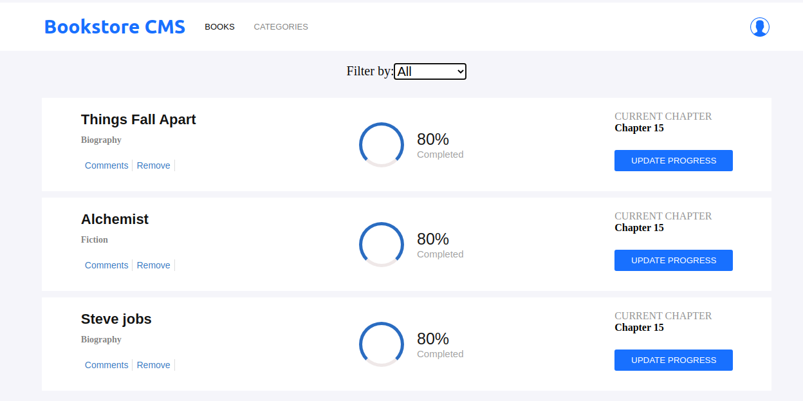

# Getting Started with Create React App

Setup the Ract-Redux-app using create-react-app.

## Screenshot

## Live Demo

[View live demo of app](https://arcane-dawn-43039.herokuapp.com/)

# Project Specification

1. Use create-react-app to initialize a new React app.
2. Delete any unnecessary file or asset.
3. Add prop-types using npm for typechecking props.
4. Add the necessary Redux packages to your project:
   - Add react-redux using npm.
   - Add redux using npm.
5. Run the application with npm start and make sure that everything works correctly.
6. Follow the instructions in create-react-app-buildpack to deploy the app to Heroku
  - Initialize a git repo
  - Create a Heroku app
  - Commit and deploy to Heroku
  - Make sure the Heroku app works correctly
  - Push everything to Github

## Built With

- Node.js
- React
- React-DOM
- React-Create-App
- Redux
- npm
- CSS
- ES6

## Getting Started

To get a local copy up and running follow these steps:

### Prerequisites

- npm
- create-react-app

### Setup

- Clone the repository by running the code `git clone https://github.com/tGodson/react-redux-app.git`.
- cd into `react-redux-app` folder
- Run `npm install`.
- Run `npm start` from your command line to open your app in the browser.

## Deployment

### Install Github Pages

follow to install the Heroku cli: https://dev.to/yuribenjamin/how-to-deploy-react-app-in-github-pages-2a1f

👤 **Tendongze Godson**

- Github: [tGodson](https://github.com/tGodson)
- Twitter: [@tendongze95](https://twitter.com/tendongze95)
- Linkedin: [linkedin](https://www.linkedin.com/in/tendongzegodson)

## Show your support

Give a ⭐️ if you like this project!

## Acknowledgments

[Microverse](www.microverse.org)
